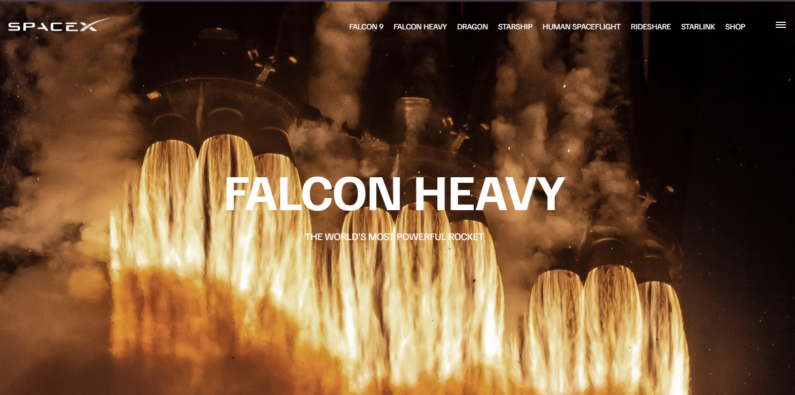

<div align="center">
  <br />
  
  <br />

  <div>
    
    
    
  </div>

  <h3 align="center">SpaceX Website</h3>

  <div align="center">
    A responsive SpaceX-themed website showcasing Falcon 9, Falcon Heavy, Dragon, and other SpaceX projects with modern design and functionality.
  </div>

  <div align="center">
    🌐 <strong>Live Demo</strong>: <a href="https://your-username.github.io/SpaceX/">SpaceX Website</a>
  </div>
</div>

---

## 📋 Table of Contents

1. [Introduction](#introduction)  
2. [Tech Stack](#tech-stack)  
3. [Features](#features)  
4. [Quick Start](#quick-start)  
5. [Installation](#installation)  
6. [License](#license)  
7. [Acknowledgements](#acknowledgements)  

---

## Introduction

This SpaceX-themed website is built using HTML, CSS, and JavaScript. It features a clean and responsive design, showcasing information about SpaceX projects such as Falcon 9, Falcon Heavy, Dragon, and more. The site includes a hamburger menu for mobile users and smooth navigation across pages.

---

## Tech Stack

- **HTML5**: Markup language for structuring the website.  
- **CSS3**: Styling language for designing the website.  
- **JavaScript**: Adds interactivity and functionality to the website.  

---

## Features

👉 **Responsive Design**: Ensures seamless functionality and aesthetics across all devices.  
👉 **Navigation Menu**: Includes a desktop menu and a hamburger menu for mobile users.  
👉 **Project Showcase**: Displays information about SpaceX projects like Falcon 9, Falcon Heavy, and Dragon.  
👉 **Smooth Animations**: Adds visual appeal to the website.  

---

## Quick Start

Follow these steps to set up the project locally on your machine.

### Prerequisites

Make sure you have the following installed:

- [Git](https://git-scm.com/)
- A modern web browser

## Cloning the Repository

```bash
git clone https://github.com/your-username/SpaceX.git
cd SpaceX
